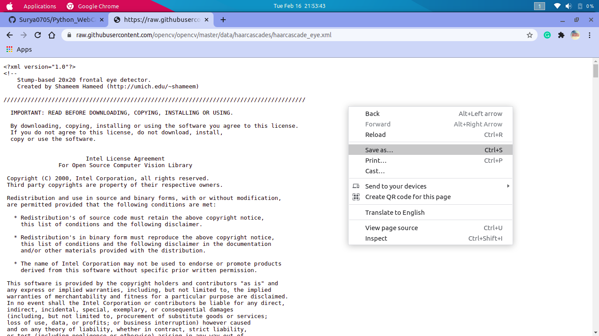
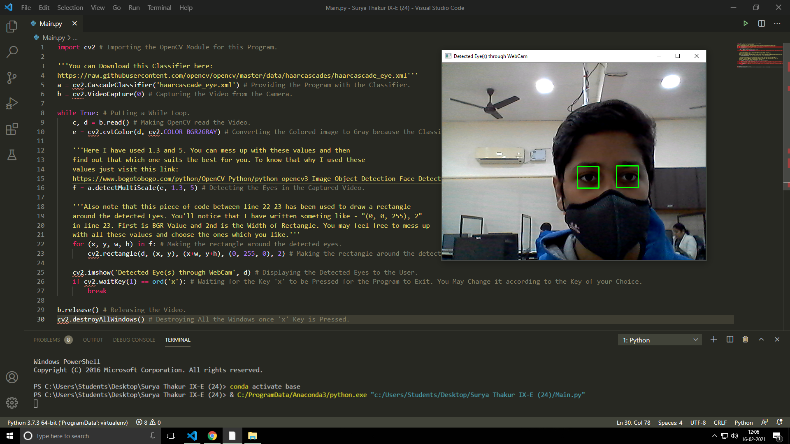

# Python_WebCam_Eye_Detection
This is a Python Program that detects your Eyes using your WebCam. It uses OpenCV Python Module for this Purpose. To install this in your system just Use the following Command (Assuming that you are on Windows):
```
pip install opencv-python
```
Or if you are on Ubuntu (10.04 LTS which I use) then just type:
```
pip3 install opencv-python
```
Or Install it according to your OS. After Installation follow the Following Instructions:
1. Install the 'haarcascade_eye.xml' by going to this [Link ](https://raw.githubusercontent.com/opencv/opencv/master/data/haarcascades/haarcascade_eye.xml).
2. After Visiting just Right-Click and then choose Save As:

4. Then Save the file in Folder you are working within. Now run the [Main.py](Main.py) and you'll see the eyes detected through your WebCam. Below is the screenshot of my Program:


FUN_FACT: You might be wondering why I have wwore mask in the Sceenshot of My Program. That's because I made this program during the Computer Period within my School Premisis and that's why as I was in School Premisis so because of COVID-19 precautions I have wore mask.

And Lastly I would just say the Hope that you liked it!
